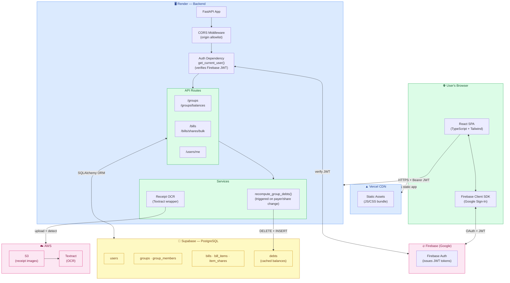

# FairShare — Architecture

## System Diagram



---

## Database Schema

| Table | Key Columns |
|---|---|
| `users` | `id`, `name`, `email`, `textract_usage_count` |
| `groups` | `id`, `name`, `currency` |
| `group_members` | `group_id`, `user_id` (composite PK) |
| `bills` | `id`, `group_id`, `paid_by_user_id`, `name`, `date`, `subtotal`, `total_tax`, `grand_total` |
| `bill_items` | `id`, `bill_id`, `item_name`, `unit_cost` |
| `item_shares` | `id`, `item_id`, `user_id`, `share_count` |
| `debts` | `id`, `group_id`, `from_user_id`, `to_user_id`, `amount` |

---

## Key Data Flows

### Save Splits
```
User saves splits
  → POST /bills/{id}/shares/bulk  [+JWT]
  → upsert item_shares in DB
  → recompute_group_debts() fires
    → DELETE FROM debts WHERE group_id=X
    → INSERT simplified pairwise debts
```

### Load Group Balances
```
User opens Group page
  → GET /groups/{id}/balances  [+JWT]
  → SELECT * FROM debts WHERE group_id=X  (fast cached read)
  → compute user_net from cached rows
  → return GroupBalances response
```

### Receipt Upload
```
User uploads photo
  → POST /bills/{id}/upload-receipt  [+JWT]
  → image saved to S3
  → AWS Textract DetectDocumentText
  → parsed items inserted into bill_items
  → user.textract_usage_count incremented
```

---

## Key Design Decisions

| Decision | Rationale |
|---|---|
| Debts cached in DB | Avoid O(bills × items × shares) computation on every page load |
| Firebase JWT on every route | True server-side auth; CORS alone is insufficient |
| Weighted integer shares | Intuitive; avoids floating point drift from percentages |
| Tax pro-rated per item | Fairest allocation — heavy orderers pay proportionally more tax |
| Alembic migrations | Safe schema evolution in production; no `create_all()` |
